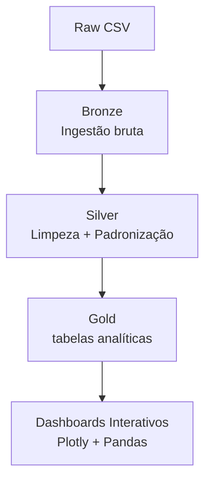

# VitaSphere
**Análise Estratégica do Setor Hospitalar Brasileiro**  
Projeto final do Grupo 6 – Residência em Ciência de Dados  
**Porto Digital / NTT DATA – 2º Semestre 2025**

Bem-vindo ao **VitaSphere**, nossa solução completa de Business Intelligence aplicada ao setor hospitalar brasileiro.  
Transformamos 6 bases brutas (atendimentos, cirurgias, exames, internações, internações por município e imunizações) em dashboards interativos que respondem às principais tendências e desafios da saúde no Brasil em 2025.
[](#)
[](#)
[](#)
[](#)
[](#)

---
---
## Sobre o Projeto
O VitaSphere nasceu para responder às demandas reais do setor hospitalar brasileiro identificadas em 2024–2025:
- 78% das clínicas já fazem agendamento online  
- 69% usam prontuário eletrônico  
- Paciente mais exigente, crítico e digital  
- Falta de dados estruturados para gestão  
- Necessidade urgente de BI, telemedicina e integração

Nosso objetivo foi entregar **insights acionáveis** para gestores do SUS e da saúde suplementar, com arquitetura moderna no Databricks e visualizações claras e interativas.

---
## O que entregamos – 3 Dashboards Principais

### 1. Cobertura Vacinal por Estado (2024–2025)
- Heatmap interativo com todos os estados ordenados do melhor ao pior  
- Meta do Ministério da Saúde destacada (≥95% e ≥90%)  
- Linha do Brasil como referência nacional  
- Identificação imediata das regiões críticas

### 2. Análise de Exames Realizados (2020–2025)
- Evolução mensal com sazonalidades claras  
- Top 15 exames mais realizados  
- Top 15 especialidades que mais solicitam  
- Três gráficos lado a lado em um único dashboard

### 3. Distribuição de Internações por Procedimento
- Dois gráficos donut interativos:  
  → Um com categoria “Outros” (≥1,50% + resto)  
  → Um apenas com os procedimentos dominantes  
- Visão cristalina de onde está concentrado o volume de internações

---
## Arquitetura da Solução (Databricks + Delta Lake)

Tudo versionado, reprodutível e escalável.

---
## Tecnologias Utilizadas
- Databricks (Unity Catalog + Delta Lake)  
- PySpark + Pandas  
- Plotly (gráficos interativos)  
- Python  
- Git & GitHub

---
## Equipe do Grupo 6
| Nome Completo       | GitHub                                     | Responsabilidade Principal                  |
|---------------------|--------------------------------------------|---------------------------------------------|
| Gabriela Bayo       | [@gabibayo](https://github.com/gabibayo)         | Arquitetura + Dashboard de Imunizações      |
| Pedro Iranildo      | [@Devpedrois](https://github.com/devpedrois)     | Líder do Grupo + Dashboard de Internações   |
| Gabriel Barbosa     | [@GazeT3](https://github.com/GazeT3)             | Dashboard de Exames + Evolução Temporal     |
| Diogo Silas         | [@ildevdio](https://github.com/ildevdio)         | Camada Gold + Qualidade dos Dados         |
| Rafael Aimbere      | [@codeblack2301](https://github.com/codeblack2301)| Documentação + README + Apresentação       |
| João Vinicius       | [@sucogelad0](https://github.com/sucogelad0)     | Camada Silver + Otimização de Consultas       |

**Todos participaram ativamente do código, das análises e da apresentação.**

---
## Informações da Entrega
- **Disciplina:** Residência em Ciência de Dados  
- **Instituição:** Porto Digital / NTT DATA  
- **Turma:** 2º Semestre 2025  
- **Tema:** Setor Hospitalar Brasileiro

**Arquivo da apresentação:**  
`Grupo6 – Hospitalar – Residência Porto Digital NTT DATA 2oSem.pptx`

**Link do repositório:**  
https://github.com/devpedrois/VitaSphere

---
## Como executar localmente (sem Databricks)
```bash
git clone https://github.com/devpedrois/VitaSphere.git
cd VitaSphere

pip install pandas plotly

python gold_imunizacoes.py    # abre o heatmap de vacinas
python gold_exames.py            # abre o dashboard de exames
python gold_internacao.py     # abre os gráficos de internação
```
Todos os gráficos abrem automaticamente no navegador.

VitaSphere – Transformando dados em saúde de verdade.
